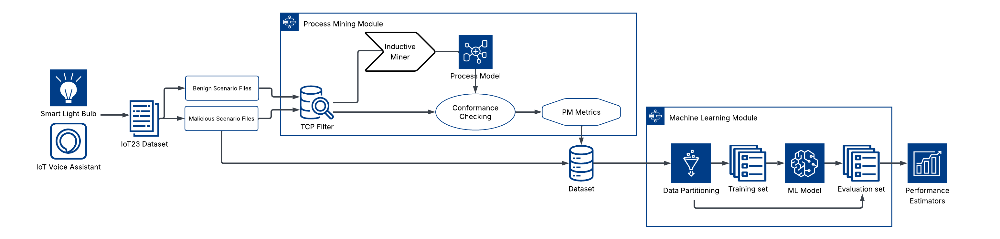

## Cyber Attack Detection with Process Mining and Machine Learning

This project demonstrates a research idea: process mining to learn what normal IoT traffic looks like, then create an ML classifier based on PM-informed features. It uses Zeek logs from the [IoT-23 dataset](https://www.stratosphereips.org/datasets-iot23) for this training. It accompanies the paper:

Burke, A.T, Ashraf, M., Kadirov, M., Janusz, A (2026). *IoT Threat Detection using Process Conformance and ML Classification*, ASPAI 2026 (forthcoming). 


Pipeline and experiment design:


Results from the ASPAI 2026 paper are those in [results/20260408](results/20260408).

Zeek logs are first split by scenario type. Benign captures train the
**process mining** module, which discovers a reference process model
and uses it to compute conformance metrics for the malicious captures.
Those metrics are joined back to the original network features and
passed to the **machine learning** module, which prepares the data,
trains a classifier (Random Forest by default; any scikit-learn
estimator works), evaluates it under **Leave-One-File-Out (LOFO)**, and
reports per-fold metrics.

The LOFO protocol matters: a random train/test split on IoT-23 leaks
data between train and test (rows from the same session sit on both
sides) and inflates accuracy. LOFO holds out one whole capture file at
a time, so the numbers reflect performance on network scenarios the
model has never seen.

---

## Table of Contents

- [Installation and Running](#instructions)
- [Structure](#structure)
- [Citation](#citation)


---

## Installation and Running

### 1. Requirements

- Python 3.14
- Download IoT-23 dataset from the official
[Stratosphere Laboratory dataset page](https://www.stratosphereips.org/datasets-iot23).
- Optional: [Graphviz](https://graphviz.org/download/) on `PATH` to
render the Petri net as an image. The pipeline runs fine without it.

### 2. Install

```bash
git clone https://github.com/adamburkegh/iot-cyber-pm-lab.git
cd iot-cyber-pm-lab/iot_ids
python -m venv .venv
# Windows PowerShell:
.\.venv\Scripts\Activate.ps1
# macOS / Linux:
source .venv/bin/activate

pip install -r requirements.txt
```

Python dependencies available in (requirements.txt).

### 3. Get the data

The Stratosphere Laboratory dataset page offers a full distribution dataset (21 GB, includes raw `.pcap` files)
and a lighter version (8.7 GB, labeled Zeek flows only); the lighter
version is sufficient for this pipeline.

Sort the Zeek `*.log.labeled` capture files into two folders by
scenario type:

```
dataset/
├── benign/      # IoT-23 benign-only scenarios (3 files)
└── malicious/   # IoT-23 malicious scenarios
```

### 4. Run

```
python -m iot_ids.run
```

What happens:

- A timestamped folder `var/<YYYYMMDD_HHMMSS>/` is created with the
discovered Petri net (`labelled petri_net.lpn`,
`stochastic_petri_net.slpn`, and `petri_net.png` if Graphviz is
installed).
- Per-fold accuracy / precision / recall / F1 and aggregated feature
importance are printed to the console.

### 5. Tweak common settings

Everything users typically want to change is in
[`iot_ids/run.py`](iot_ids/run.py).


---


## Structure

```
/
├── iot_ids/                # Python code
│   └── run.py              # Entry point
├── dataset/                # Drop IoT-23 .log.labeled files here
├── results/                # Shared experimental results and models
└── var/                    # Output folder populated at runtime
```


---

## Citation

If this code or its results help your research, please cite the accompanying ASPAI 2026 paper *"IoT Threat Detection using Process Conformance and ML Classification".*

